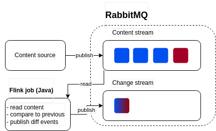

# change-detector

Flink job for observing stream of text content and detecting changes



## Instructions

```
# 1. Build image for content_generator
# from /content_generator
docker build . -t content-generator:0.1

2. build flink job
mvn clean package

3. run
docker-compose up -d
```
